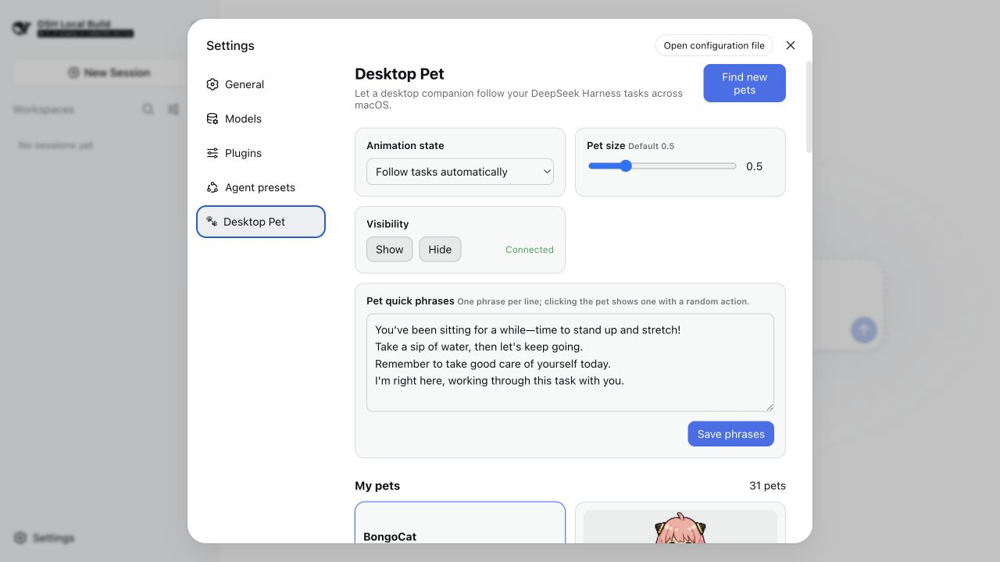
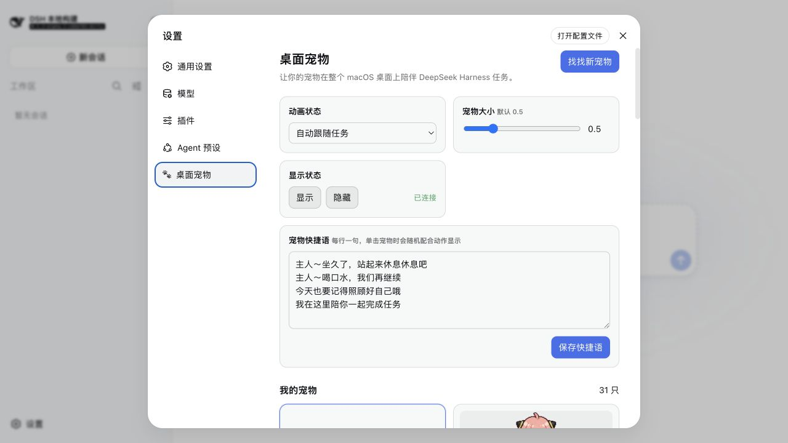
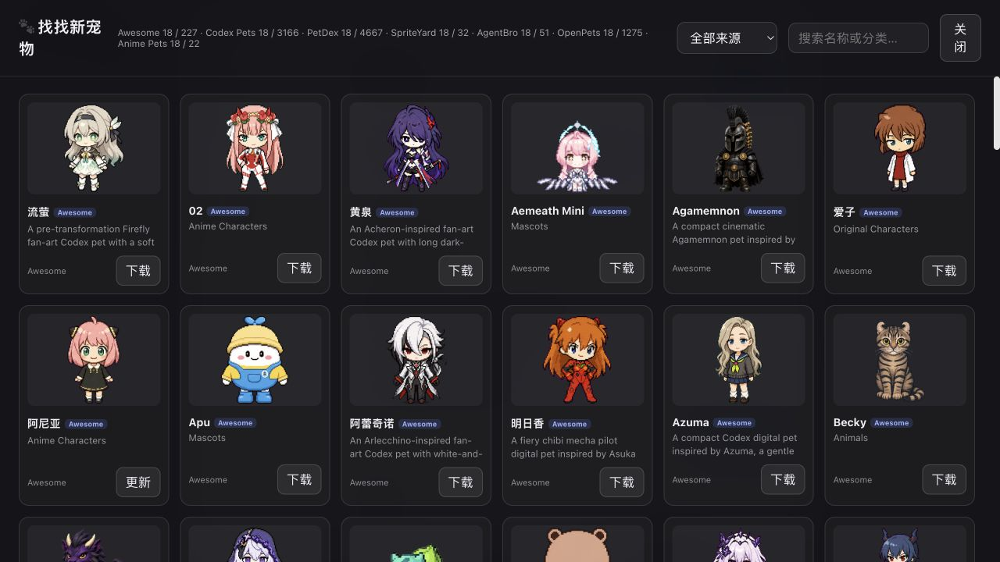

# Codex DeskPet for DeepSeek Harness

A macOS desktop companion for [DeepSeek Harness](https://github.com/deepseek-ai/deepseek-harness), **compatible with the entire Codex pet ecosystem**. Let your favorite character stay with you while you work and wait for tasks to finish.

[简体中文](README.zh-CN.md)

## Highlights

- Dedicated **Desktop Pet** section inside DeepSeek Harness settings.
- A desktop companion you can freely drag around.
- Double-click to return to the open Harness page.
- Click for a random action and a custom quick phrase.
- Running and waiting tasks appear in a bubble above the pet.
- Saved scale, position, visibility, selected pet, and phrases.
- English and Chinese UI follows the current Harness language.
- **Compatible with all Codex pet repositories:** download, switch, and enjoy pets in one place.
- Direct catalog integrations: Awesome Codex Pet, Codex Pets, PetDex, SpriteYard, AgentBro, OpenPets, and Codex Anime Pets.
- Search, filters, and smooth infinite scrolling in the pet store.

## Screenshots

### English desktop-pet settings



### Chinese desktop-pet settings



### Pet store



## Default pet

BongoCat is the default pet.

## Requirements

- macOS 13 or later
- Git

The installer prepares everything else automatically.

## Install

```bash
git clone https://github.com/yihanz0107/codex-deskpet-for-deepseek-harness.git
cd codex-deskpet-for-deepseek-harness
./install.sh
```

The installer finds DeepSeek Harness automatically and sets it up too when needed.

## Run

```bash
deepsshpet
```

This command starts both DeepSeek Harness and the desktop pet. If Harness is already running, it focuses the existing page instead of starting a duplicate service or opening another tab.

If an API Key has not been set yet, the first launch asks for one.

Open **DeepSeek Harness → Settings → Desktop Pet** to select pets, change size, edit quick phrases, show or hide the pet, and open the full-screen catalog.

## License

Project code is MIT licensed. Third-party pet artwork, characters, and trademarks remain subject to their respective owners and source terms; see [THIRD_PARTY_PETS.md](THIRD_PARTY_PETS.md).

## Pet Sources & Thanks

Special thanks to [ayangweb/bongocat](https://github.com/ayangweb/bongocat) and everyone who created and contributed to BongoCat. This project exists because I love the cat they made, and I wanted it to spend more time by my side—not only in its original application, but also while I use DeepSeek Harness. BongoCat is the default DeskPet and the starting point of this project.

Our sincere thanks go to the following open-source projects, pet markets, asset communities, maintainers, and pet creators. Their work on formats, artwork, tooling, and community catalogs makes the DeskPet catalog possible:

- [Awesome Codex Pet](https://github.com/legeling/awesome-codex-pet)
- [Codex Pets](https://codex-pets.net/)
- [PetDex](https://petdex.dev/)
- [SpriteYard](https://www.spriteyard.com/)
- [AgentBro Pet Market](https://www.agentbro.net/pets)
- [OpenPets](https://openpets.dev/gallery)
- [Codex Anime Pets](https://github.com/chenxin-dlut/codex-anime-pets)

Special thanks to everyone who draws, uploads, maintains, and shares desktop pets. DeskPet provides technical compatibility and local loading only; all artwork copyrights, licenses, character rights, and trademarks remain with their original creators and respective rights holders.
